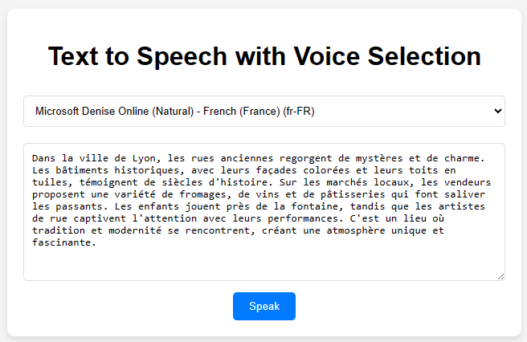

# Text to Speech with Voice Selection

This project is a simple web application that allows users to convert text to speech using the Web Speech API's SpeechSynthesis interface. It includes a feature to select from available voices on the system.

## Features

- Convert any entered text into speech.
- Choose from different voices provided by the system's speech synthesis capabilities.
- Customize the behavior of the text-to-speech conversion through a simple and user-friendly interface.

## Installation

No installation is required for this project. Simply clone the repository and open the `index.html` file in any modern web browser.

```bash
git clone https://github.com/darioernesto-roca/text-to-speech-app.git
cd text-to-speech-app
```

Open the index.html file in your browser to run the application.

## Preview
-----
You can see a live preview of the application [here](https://darioernesto-roca.github.io/text-to-speech-app/) or check out the screenshot below:


## Usage
-----

1.  Select a Voice: Use the dropdown to choose from the available voices on your system.
2.  Enter Text: Type or paste the text you want to be spoken in the text area.
3.  Click 'Speak': Press the 'Speak' button to hear the text read aloud by the selected voice.

## Technologies Used
-----------------

-   HTML5
-   CSS3 for basic styling
-   JavaScript for interaction and utilizing the Web Speech API

## Browser Compatibility
---------------------

This application relies on the Web Speech API, particularly the `SpeechSynthesis` interface. It should work in most modern browsers, including:

-   Chrome
-   Firefox
-   Safari
-   Edge

## Contributing
------------

Contributions, issues, and feature requests are welcome! Feel free to check [issues page](https://github.com/darioernesto-roca/text-to-speech-app/issues) if you want to contribute.

License
-------

This project is licensed under the MIT License - see the LICENSE.md file for details.


Replace `https://github.com/darioernesto-roca/text-to-speech-app.git` with the actual URL of your GitHub repository. This README provides a brief overview of the project, its features, how to use it, and other relevant information.
